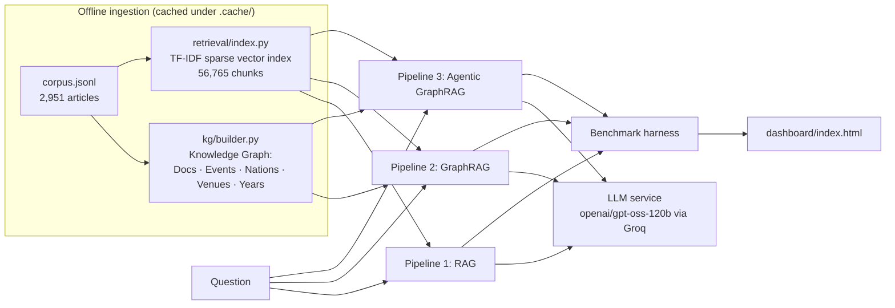
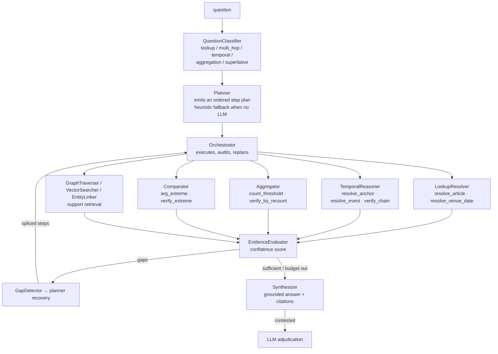
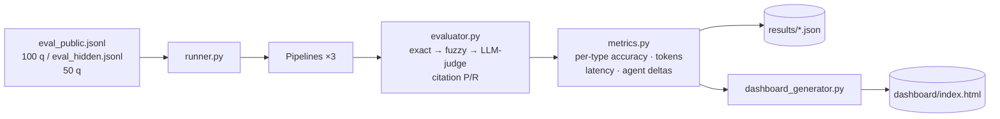
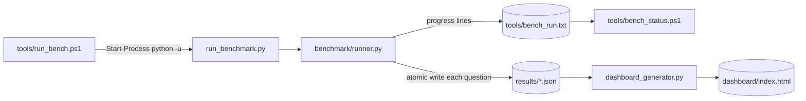

# Architecture

## System overview

All three pipelines share one output contract (`pipelines/base.py` →
`PipelineResult`): answer, citations, tokens, latency, retrieval steps,
`tools_called`, `agents_invoked`, `stop_reason`, per-step timings and evidence.

## The three pipelines

### Pipeline 1 — RAG (`pipelines/rag_pipeline.py`)

One vector-search shot over the TF-IDF chunk index (`rag_top_k=5`), chunks
re-ranked by lexical overlap, then a single LLM call. Baseline: no graph, no
planning, no retry. 1 retrieval step, ~1.0 LLM calls per question.

### Pipeline 2 — GraphRAG (`pipelines/graphrag_pipeline.py`)

Single-shot *graph-augmented* retrieval:

1. Vector search finds seed documents (`top_k=10`).
2. Entity linking attaches seed docs to KG vertices (nation, event, venue, year).
3. One-hop expansion pulls related documents through graph edges (same-nation
   athletes at the same games, events at the same venue…).
4. Chunks + graph context go to the LLM in **one** call, which also adjudicates
   the structured candidate.

No replanning: the retrieval shape is fixed regardless of question type. 2
retrieval steps, ~1.0 LLM calls, but ~10 chunks of context per question.

### Pipeline 3 — Agentic GraphRAG (`pipelines/agentic_pipeline.py`)

Key mechanisms:

- **Question classifier + LLM planner** (`agents/classifier.py`,
  `agents/planner.py`) — classify into a strategy, then emit an ordered step
  plan (with a heuristic fallback when no LLM is available).
- **Deterministic solvers** (`reasoning/solvers.py`) — counts, superlatives,
  venue/date lookups and temporal ordering are computed over the KG, not
  hallucinated by the LLM. The LLM plans, adjudicates and phrases; it does not
  invent numbers.
- **Evidence evaluation + gap detection** (`agents/evidence_evaluator.py`,
  `agents/gap_detector.py`) — after each step the orchestrator decides:
  continue, backfill a specific gap, or stop.
- **Stopping criteria** — `confidence ≥ 0.9` (→ `confidence_reached`), plan
  exhausted, `max_steps=15`, or no new information for `stale_step_limit=2`
  steps (→ `no_new_information`). Recovery is bounded by `max_replans=3` and
  `max_widen_attempts=2`. A more specific stop reason is never overwritten by
  the staleness guard.
- **Full trace** — every step records its agent, operation, latency, tokens,
  evidence and `confidence_after`; the dashboard replays it as a waterfall.

### Agent routing (measured on the public set)

| Agent | Questions dispatched | Question types served |
|---|---|---|
| `EntityLinker` | 100 | all (always runs) |
| `EvidenceEvaluator` | 100 | all |
| `Synthesizer` | 100 | all |
| `VectorSearcher` | 69 | fallback / support retrieval |
| `GraphTraverser` | 59 | fallback / support retrieval |
| `LookupResolver` | 47 | lookup (19) + multi_hop (28) |
| `TemporalReasoner` | 22 | temporal (22) |
| `Aggregator` | 21 | aggregation (21) |
| `Comparator` | 10 | superlative (10) |

The last four rows show the router working exactly as designed: each
question type reaches its own specialist, and no specialist fires on a type it
does not serve.

## Benchmark harness

Evaluation ladder (cheap-first): **exact match** → **fuzzy containment**
(normalised) → **LLM-as-judge** (only for near-misses, strict JSON verdict) →
**citation overlap** reported independently as precision/recall against
`gold_doc_ids`. The results file is rewritten after every question, so
interrupted runs keep completed work.

## Running the benchmark

A full sweep is 300 pipeline runs (100 questions × 3 pipelines) and takes
20–30 minutes wall-clock — dominated by LLM rate limits, not compute. Two
properties make this safe and observable:

| Property | Mechanism |
|---|---|
| **Never blocks the terminal** | `tools/run_bench.ps1` launches `python -u` detached with stdout/stderr redirected to `tools/bench_run.txt` and returns immediately |
| **Progress is always inspectable** | `tools/bench_status.ps1` reads that log and prints questions completed, a live per-pipeline OK tally, the last progress lines, stderr tail and the number of entries already written |
| **Crash-safe** | `runner.py` rewrites `results/*.json` atomically (temp file + `os.replace`) after each question; a per-pipeline exception is captured into the record instead of killing the run |
| **Resumable** | `--resume` / `-Resume` loads existing entries and skips those `qid`s, so an interrupted sweep continues rather than restarting |
| **Live progress lines** | one line per question: `[  7/100] pub-007 temporal RAG=F GraphRAG=F Agentic=OK tok=1211 elapsed=78s` |

## Results provenance: no silent deterministic fallback

The harness has one property that is easy to get wrong when reading its
output: **a run always finishes.** If the provider rate-limits, returns
unusable completions or the key is absent, every pipeline degrades to the
deterministic solvers and still writes a complete, well-formed results file.
Accuracy in that file is real, but it is *deterministic* accuracy, and the token
columns are zero.

So the contribution of the LLM is recorded explicitly rather than inferred:

| Layer | What it records |
|---|---|
| per-question record | `llm_calls`, `tokens_per_operation` (caller-prefixed: `agent.react`, `classifier.classify`, `agent.adjudicate.*`) |
| summary | `llm` (calls, failures, pacer sleeps, circuit trips) and `llm_activity` (provider calls per pipeline) |
| dashboard | the **Provider contribution** panel, plus `provenance.warnings` |
| audit | `tools/audit_results.py` — non-zero exit when a pipeline took part in a provider-using run but recorded no calls of its own, or when a file was written by an older revision of the pipelines |

Two failure shapes look alike in a results file and must not be conflated:

| Shape | `llm_calls` | `output_tokens` | Meaning |
|---|---|---|---|
| deterministic fallback | `0` | `0` | no call was made — the solvers answered, as designed |
| provider failure | `> 0` | `0` | calls were attempted and returned nothing usable, so every answer is still the solver's |

`llm_activity` separates them per pipeline (`records_with_calls` vs
`records_answering`), the summary carries `run_mode` (`live` /
`provider-failed` / `deterministic`), and the dashboard names the reason instead
of printing a bare "0 calls/q". Publishing is gated two ways: `--require-llm` on
`benchmark.dashboard_generator` refuses to build the headline page from a file in
which no pipeline recorded provider output, and `tools/validate_dashboard.py`
asserts that the published page's counters are consistent and that any pipeline
with failed calls is named in the page's own warnings.

Because a run's mode is a property of the *run*, not of the architecture, the two
modes are published as two pages from two files: `dashboard/index.html`
(LLM-assisted, `results/llm_results.json`) beside `dashboard/baseline.html`
(deterministic, `results/deterministic_results.json`).

`--summarize-only` rebuilds a summary from an existing results file. Provider,
evaluator and backend telemetry is only known *during* a run, so a rebuilt
summary reports those blocks as `null` and says so in `provenance`, instead of
guessing values it cannot know.

## Graph backend: local mirror or TigerGraph

`kg/backend.py::open_graph` is the one place that decides who answers the graph
calls. With `TG_ENABLED` unset nothing about the system changes — the local
JSON graph (`kg/`) built from `corpus.jsonl`, served from `.cache/`. With
`TG_ENABLED=true` the same graph is served by TigerGraph (`tg/`): the corpus
graph is still built and kept as a **mirror**, and `TigerGraphBackend` pushes
only the two hot paths down (`filter_events`, `neighbours`), so the pipelines
and the agent's `GraphTools` cannot tell which one answered.

Three properties make that safe for a measured benchmark:

| Property | Mechanism |
|---|---|
| **No silent wrong answers** | the first remote answer per call site is verified against the mirror (remote ids ⊆ the uncapped mirror answer, exact match when the answer fits the row budget); a mismatch is recorded as an ingest defect, not served to the agent |
| **No failed runs** | any error — server down, schema/query missing, partial ingest — degrades *per entry point* to the mirror with a printed reason and a counter; `--no-tg` forces local outright |
| **No silent truncation** | `TG_MAX_ROWS` is a safety valve: a budget below the candidate set produces a loud run note, and tool parity (agent sees identical output on both backends) is checked with a lossless budget |

Counters for every remote answer, fallback and disagreement are recorded in
`summary["backend"]` (visible on the dashboard), so "which store actually
answered" is always a reported fact. Offline verification needs no server:
`tools/test_tg_backend.py` drives the real client against an in-process RESTPP
double (`tg/fake_server.py`); `tools/probe_tg_live.py` proves the same wiring
against any `TG_HOST`.

## Deployment posture

The system is **self-contained by default**: the knowledge graph and sparse
TF-IDF index are built once from `corpus.jsonl` and cached under `.cache/`, so
at query time there is no database, container or vector service to run — only
an outbound HTTPS call to the LLM API (Groq, `openai/gpt-oss-120b`). The
TigerGraph backend is wired in the same way a dense-embedding backend would be:
a drop-in behind `kg/` and `retrieval/`, because pipelines only consume the
`Index` and `KnowledgeGraph` interfaces — enabling it is a configuration
change (`TG_ENABLED`), and losing it mid-run is a fallback, not a failure.
